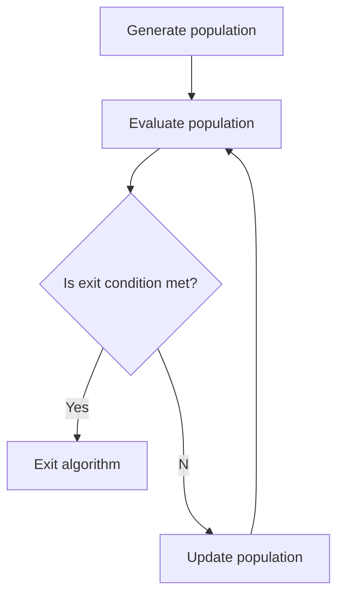

[](https://dl.circleci.com/status-badge/redirect/gh/mwolinska/Evolutionary-Optimisation/tree/main)
[](https://dl.circleci.com/status-badge/redirect/gh/mwolinska/Evolutionary-Optimisation/tree/main)

# Evolutionary-Optimisation
A generic evolutionary algorithm for function optimisation.

## Introduction
This package allows the user to optimise a function using an evolutionary algorithm.
An [evolutionary algorithm](https://en.wikipedia.org/wiki/Evolutionary_algorithm) uses the principles of evolution to find optimal solutions.
At a high level diagram of the process is as follows:



Currently, the only exit condition for the code is running the desired
number of generations.

## Using the Package
### Getting Started 
To get started with this package clone this repo:

```bash
git clone https://github.com/mwolinska/Evolutionary-Optimisation
```
Then enter the correct directory on your machine:
```bash
cd Evolutionary-Optimisation
```
This package uses [poetry](https://python-poetry.org) dependency manager. 
To install all dependencies run:

```bash
poetry install
```

### Running experiments
To run the code type the following in your terminal. The default experiment is a 
simple optimization of the $x^{2}$ using integers.
```bash
run_evolution
```
The parameters used for the run can be edited within the main.py file.

```python
    genotype_class = Genotype.get_genotype(Genotypes.INTEGER_LIST)
    phenotype_class = Phenotype.get_phenotype(Phenotypes.PARABOLA)

    evolutionary_algorithm = Evolution(
        phenotype=phenotype_class(genotype_class()),
        number_of_individuals=10,
        number_of_generations=5,
        fitness_function=FitnessFunctions.MINIMIZE,
        ratio_of_elite_individuals=0.1
    )
```

This will produce the following output:
```bash
The value of the best individual is [1]
```

And the graph of fitness over time will be generated:


## Documentation
You can consult our documentation [here](https://mwolinska.github.io/Evolutionary-Optimisation/)
