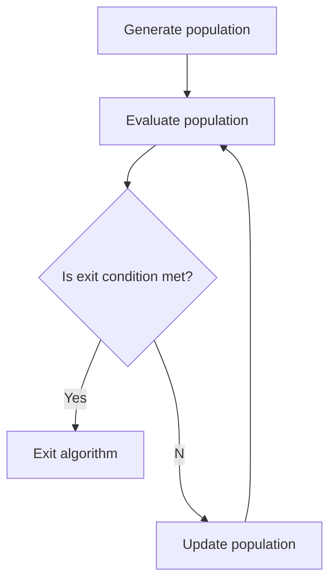
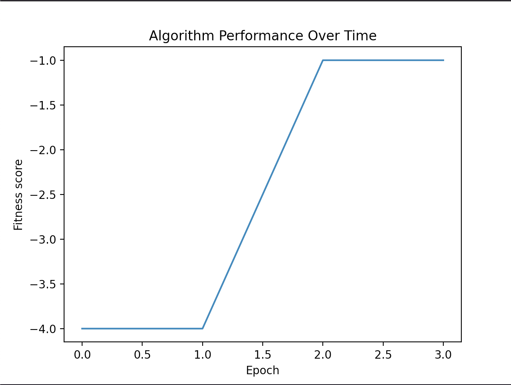

[](https://dl.circleci.com/status-badge/redirect/gh/mwolinska/Evolutionary-Optimisation/tree/main)
[](https://dl.circleci.com/status-badge/redirect/gh/mwolinska/Evolutionary-Optimisation/tree/main)

# Evolutionary-Optimisation
A generic evolutionary algorithm for function optimisation.

## Introduction
This package allows the user to optimise a function using an evolutionary algorithm.
An [evolutionary algorithm](https://en.wikipedia.org/wiki/Evolutionary_algorithm) uses the principles of evolution to find optimal solutions.
At a high level diagram of the process is as follows:



Currently, the only exit condition for the code is running the desired
number of generations.

## Using the Package
### Getting Started 
To get started with this package clone this repo:

```bash
git clone https://github.com/mwolinska/Evolutionary-Optimisation
```
Then enter the correct directory on your machine:
```bash
cd Evolutionary-Optimisation
```
This package uses [poetry](https://python-poetry.org) dependency manager. 
To install all dependencies run:

```bash
poetry install
```

### Running experiments
To run the code type the following in your terminal.
```bash
python3 main.py
```
The parameters used for the run can be edited within the main.py file.

```python
    test_evolution = Evolution(n_individuals=3,
                               n_generations=4,
                               genotype_key=GenotypeKey.LIST,
                               n_genes=2,
                               individual_value_range=(-10, 10),
                               mutation_probability=1,
                               crossover=True
                               )

```

This will produce the following output:
```bash
The value of the best individual is [1]
```

And the graph of fitness over time will be genertated:


The algorithm currently only returns integers and currently maximises the function -x^2.
The function can be changed in phenotype.py in the a_func() function.
